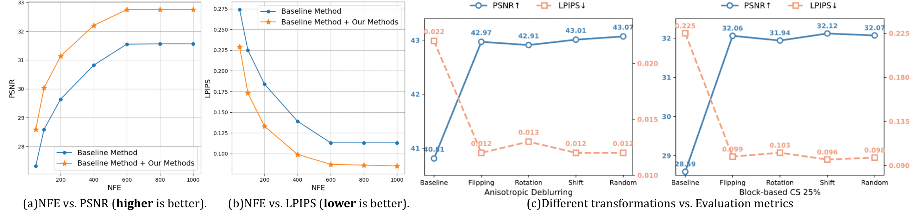
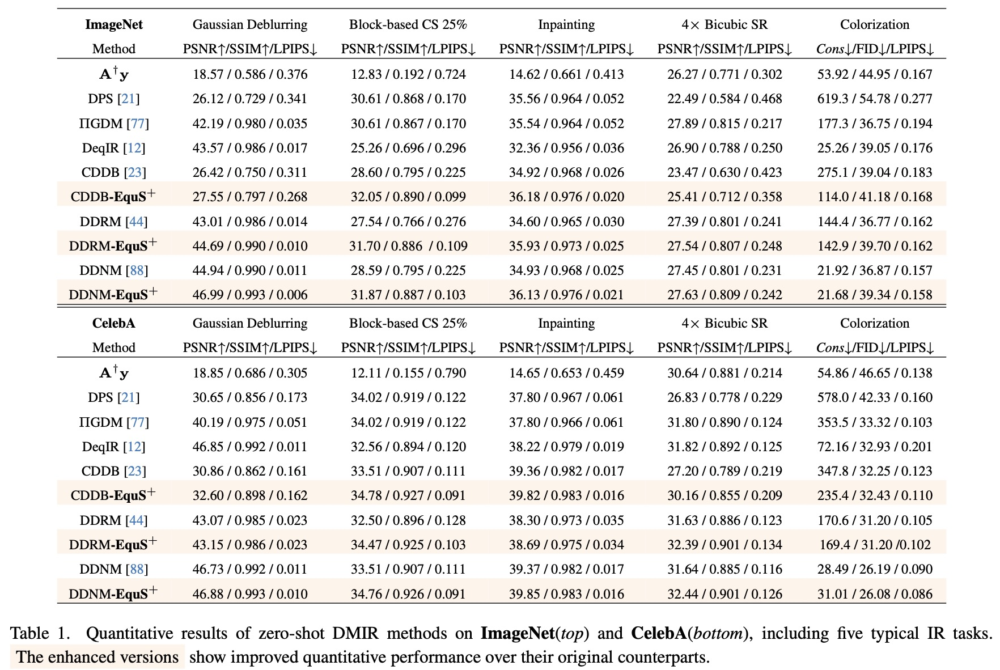

# Equivariant Sampling for Improving Diffusion Model-based Image Restoration
## 📖[**Paper**](https://arxiv.org/abs/2511.09965)


[Chenxu Wu](https://fouierl.github.io/chenxuwu.github.io/), [Qingpeng Kong](https://kqp1227.github.io/), [Peiang Zhao](https://scholar.google.com/citations?user=mVcmH3oAAAAJ&hl=en), [Wendi Yang](https://scholar.google.com/citations?user=fBEI1DgAAAAJ&hl=zh-CN), [Wenxin Ma](https://mwxinnn.github.io/about/), [Fenghe Tang](https://fenghetan9.github.io/) ,[Zihang Jiang](https://scholar.google.com/citations?user=Wo8tMSMAAAAJ), [S.Kevin Zhou](https://scholar.google.com/citations?user=8eNm2GMAAAAJ)

from [MIRACLE Center](https://miracle.ustc.edu.cn/main.htm), USTC

(Questions mail to 📧wuchenxu@mail.ustc.edu.cn)


Our method offers (a) superior quantitative performance, (b) improved qualitative results. It is (c) adaptable to various IR applications, (d) robust to different scales, and (e) resilient to different noise levels. $\y$ represents the degraded image, $\x_0$ denotes the sampling result, SR represents super-resolution and CS represents compressed-sensing.

---

### Pre-Trained Models
To restore human face images, download this [model](https://drive.google.com/file/d/1wSoA5fm_d6JBZk4RZ1SzWLMgev4WqH21/view?usp=share_link)(from [SDEdit](https://github.com/ermongroup/SDEdit)) and put it into `DDNM/exp/logs/celeba/`. 
```
https://drive.google.com/file/d/1wSoA5fm_d6JBZk4RZ1SzWLMgev4WqH21/view?usp=share_link
```
To restore general images, download this [model](https://openaipublic.blob.core.windows.net/diffusion/jul-2021/256x256_diffusion_uncond.pt)(from [guided-diffusion](https://github.com/openai/guided-diffusion)) and put it into `DDNM/exp/logs/imagenet/`.
```
wget https://openaipublic.blob.core.windows.net/diffusion/jul-2021/256x256_diffusion_uncond.pt
```

### Datasets
Datasets can be accessed via the official repository of DDNM: [DDNM GitHub Repository](https://github.com/wyhuai/DDNM).

Download the CelebA testset and put it into `DDNM/exp/datasets/celeba/`.

Download the ImageNet testset and put it into `DDNM/exp/datasets/imagenet/` and replace the file `DDNM/exp/imagenet_val_1k.txt`.

### Quick Start
To execute **EquS**, kindly follow the instructions in the `"evaluation.sh"` script provided in the repository.

---
### Robustness on different image transformations
Our method remains equally effective with different image transformations:


(a,b) NFE vs. Evaluation metrics (block-based CS 25\%). Our method is not limited by specific NFE. (c) Different transformations vs. Evaluation metrics. Random: Randomly select one transformation.

---
### Results to cite
Please refer to our [**Paper**](https://arxiv.org/abs/2511.09965) for more results.



# References
If you find this repository useful for your research, please cite the following work.
```
Wu C, Kong Q, Zhao P, et al. Equivariant Sampling for Improving Diffusion Model-based Image Restoration[J]. arXiv preprint arXiv:2511.09965, 2025.
```
This implementation is based on / inspired by:
- [DDNM GitHub Repository](https://github.com/wyhuai/DDNM)
Thanks to the authors of DDNM for their great work.
